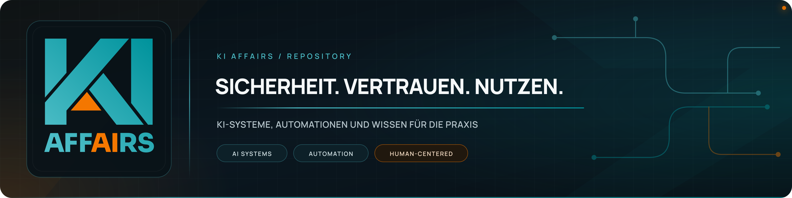
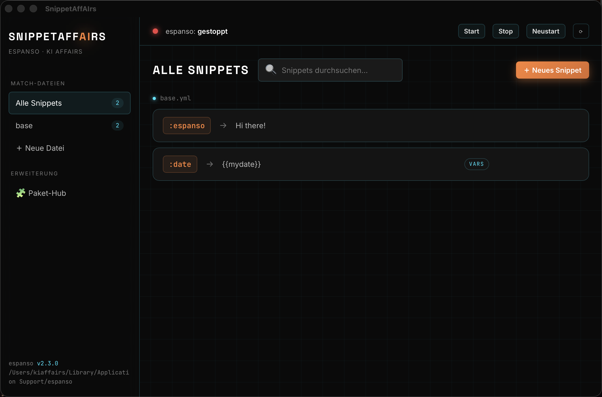

<!-- ki-affairs-banner:start -->
<p align="center">
  
</p>
<!-- ki-affairs-banner:end -->

<h1 align="center">SnippetAffAIrs</h1>

<p align="center">
  <b>Your text snippets on a keystroke — everywhere, instantly, in a beautiful UI.</b><br>
  A desktop app that turns a few typed characters into whole blocks of text.
</p>

<p align="center">
  <a href="https://github.com/clauszeissler-dot/snippetaffairs/releases/latest"></a>
  &nbsp;
  
</p>

<p align="center">
  🇬🇧 English (this page) &nbsp;·&nbsp; <a href="README.md">🇩🇪 Deutsche Version</a>
</p>

---

## What is it? (in one sentence)

You type e.g. `:mail` and your full signature appears instantly. Or `:tel` → your phone number.
Or `:date` → today's date. **In any application** — email, Word, browser, chat. SnippetAffAIrs is
the clean, simple interface for creating and managing those shortcuts.

<p align="center">
  
</p>

## What can the app do?

- ⌨️ **Manage snippets** — create, edit, delete and search trigger → replacement pairs.
- 🗂️ **Stay organized** — group snippets across multiple files (e.g. "Work", "Personal").
- 🟢 **On/off in one click** — see status, start/stop/restart.
- 🧩 **Package Hub** — install ready-made snippet collections from the espanso community
  (emojis, symbols, boilerplate) with a single click.
- 🛡️ **Safe** — a backup of your file is created automatically before every change.

---

## ⬇️ Download & Install (easy)

> **Prerequisite:** SnippetAffAIrs is the interface for the free engine **espanso**.
> You install that once — a single command or click, see below.

### 1. Download SnippetAffAIrs — pick your system

<p align="center">
  <a href="https://github.com/clauszeissler-dot/snippetaffairs/releases/latest/download/SnippetAffAIrs-macOS-AppleSilicon.dmg"></a>
  &nbsp;
  <a href="https://github.com/clauszeissler-dot/snippetaffairs/releases/latest/download/SnippetAffAIrs-Windows-Setup.exe"></a>
  &nbsp;
  <a href="https://github.com/clauszeissler-dot/snippetaffairs/releases/latest/download/SnippetAffAIrs-Linux.AppImage"></a>
</p>

> ℹ️ Each button downloads the matching package **directly**. Other variants
> (macOS Intel `.dmg`, Windows `.msi`, Linux `.deb`/`.rpm`) are on the
> [Releases page](https://github.com/clauszeissler-dot/snippetaffairs/releases/latest).
> All packages are built automatically by GitHub Actions (see "For developers").

**Which file do I need?**

| System | File | Install |
|--------|------|---------|
| 🍎 macOS (Apple Silicon, M1–M4) | `SnippetAffAIrs_…_aarch64.dmg` | Open → drag the app into "Applications" |
| 🍎 macOS (Intel) | `SnippetAffAIrs_…_x64.dmg` | same |
| 🪟 Windows | `SnippetAffAIrs_…_x64-setup.exe` | Double-click → "Install" |
| 🐧 Linux | `.AppImage` (make executable) **or** `.deb` | run the AppImage or `sudo dpkg -i …` |

<details>
<summary>🍎 <b>macOS says "unverified / cannot be opened"?</b> (one time)</summary>

Normal for apps not (yet) signed by Apple — not an error, not a risk. Open it anyway,
depending on your macOS version:

- **macOS 14 and older:** **right-click the app → "Open" → click "Open" again in the dialog.**
- **macOS 15 (Sequoia) and newer:** double-click once (dismiss the message), then open
  **System Settings → Privacy & Security**, scroll to the bottom where it says
  "SnippetAffAIrs was blocked…" → **"Open Anyway"** → confirm.

After that it always launches normally. (Signed builds without this prompt are in the works.)
</details>

<details>
<summary>🪟 <b>Windows says "Windows protected your PC" (SmartScreen)?</b> (one time)</summary>

Also normal for apps without an (expensive) code-signing certificate. To run the installer:
**click "More info" in the blue window → then "Run anyway".** The installer then proceeds normally.
</details>

### 2. Install espanso (the engine, one time)

<details>
<summary>🪟 <b>Windows</b></summary>

Download the espanso installer from **[espanso.org/install](https://espanso.org/install/)** and run it.
Or via Winget: `winget install espanso`.
</details>

<details>
<summary>🍎 <b>macOS</b></summary>

Got [Homebrew](https://brew.sh)? Then in the terminal:
```bash
brew install --cask espanso
```
</details>

<details>
<summary>🐧 <b>Linux</b></summary>

See **[espanso.org/install](https://espanso.org/install/)** (AppImage/Snap/packages).
</details>

### 3. Go
Open SnippetAffAIrs → click **Start** at the top → done. 🎉

---

## 🍎 The one important step on macOS

For espanso to type text into other apps, it needs your permission once (this is Apple's security
mechanism, not an error):

1. **System Settings** → **Privacy & Security** → **Accessibility**
2. **Enable Espanso** in the list (tick the box).
3. In SnippetAffAIrs click **Start** at the top → the indicator turns **green**.

Now type `:espanso` anywhere — it becomes "Hi there!". Working. ✅

---

## ⌨️ How to use it

1. Click **＋ New Snippet**.
2. **Trigger** = your shortcut (e.g. `:mail`). Tip: starting with `:` avoids accidental triggers
   inside words.
3. **Replacement** = the text to insert.
4. **Save** — ready immediately, in any application.

**Package Hub:** click **🧩 Package Hub** on the left → search → **Install**. Ready-made
collections (e.g. all emojis via `:emoji`) land directly in your setup.

---

## ℹ️ What is espanso?

[espanso](https://espanso.org) is a free, open-source text expander (GPL-3.0) that works entirely
through simple files — but deliberately ships **without** a graphical interface. **SnippetAffAIrs
is exactly that interface**: a standalone app that makes espanso comfortable and beautiful to use.
All snippets remain regular espanso files — you're never locked in.

---

## 🛠️ For developers

SnippetAffAIrs is a **[Tauri](https://tauri.app)** app (Rust backend + React/TypeScript frontend).

```bash
# Requirements: Node/Bun, Rust (rustup), espanso installed
git clone https://github.com/clauszeissler-dot/snippetaffairs.git
cd snippetaffairs
bun install
bun run tauri dev      # development
bun run tauri build    # build an installer for your OS
```

Architecture in brief:
- `src-tauri/src/espanso.rs` — reads/writes espanso's YAML match files (atomic + backup),
  controls service & packages via the espanso CLI.
- `src/` — React UI in the KI AffAIrs design (sidebar, editor, package hub).

Installers for all platforms are built automatically via GitHub Actions (see
`.github/workflows/release.yml`) — every published tag produces a release with `.exe`, `.dmg`
and Linux packages.

---

## 📄 License

**[CC BY 4.0](LICENSE)** (Attribution 4.0 International) — free to use, share and adapt,
including commercially, **as long as you credit the creator**:
"KI AffAIrs (Claus Zeißler)" · [affairs-consulting.de](https://www.affairs-consulting.de).

espanso itself is GPL-3.0 and is only invoked as a separate program (not embedded).

---

<p align="center">
  A tool by <b>KI AffAIrs</b> · <a href="https://www.affairs-consulting.de">affairs-consulting.de</a><br>
  <sub>Pragmatic AI tools for the German Mittelstand.</sub>
</p>
